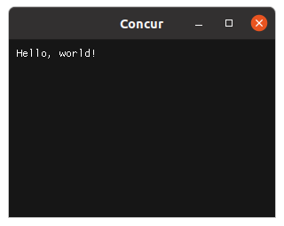
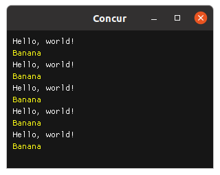
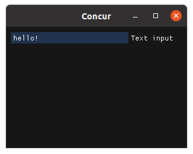
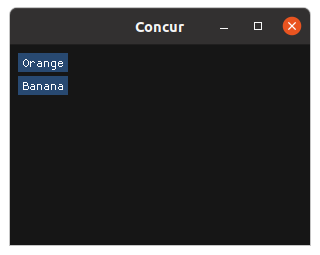
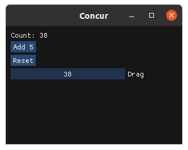
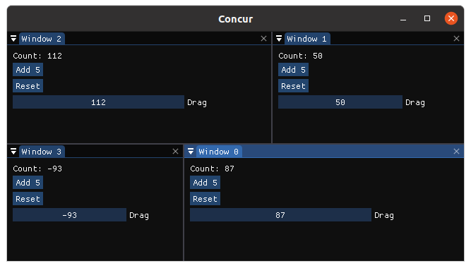

# Introduction

This tutorial walks you through the basic usage of the [Python Concur GUI library](https://potocpav.github.io/python-concur-docs/homepage.html). If you don't have Concur on your machine, you can [install it easily](https://github.com/potocpav/python-concur#installation) using Pip.

I encourage you to experiment with the commands below to get a better feel of what the possibilities are. All the code snippets below can be (sequentially) pasted into a Python interactive prompt.

Start by running the interactive prompt in console, spin up a local Jupyter notebook, or use your favorite IDE's REPL.

```bash
$ python3
Python 3.7.5 (default, Apr 19 2020, 20:18:17)
[GCC 9.2.1 20191008] on linux
Type "help", "copyright", "credits" or "license" for more information.
>>>
```

Inside the Python prompt, import Concur qualified:

```python
import concur as c
```

This is all we need to create widgets. No additional setup is required. For example, a simple passive text widget:

```python
label = c.text("Hello, world!")
```

The above line created the widget, but it doesn't show it on its own. A lot of stuff must happen to display widgets: window must be created, event loop must be started, etc. This is all handled by a single function invocation in Concur:

```python
c.main(label)
```



This line creates a default window with a widget `label` inside. After closing the window, the Python prompt can be used again. Window size and title can be customized using [optional arguments](https://potocpav.github.io/python-concur-docs/master/integrations/glfw.html).

## Composition

It isn't very exciting to just display some passive text in a window. We want a way to display multiple widgets at once. But we can't pass them into `c.main`, as it only accepts a single widget. This is what the `c.orr` function is for: it composes a list of widgets into a single widget:

```python
banana = c.text_colored("Banana", "yellow")
pair = c.orr([label, banana])
```

We created a new widget, `banana`, and composed it with the `label` into a single widget called `pair`. It can be displayed as usual:

```python
c.main(pair)
```

This `c.orr` function opens up a whole lot of possibilities. We can create whole lists of widgets trivially:

```python
c.main(c.orr([pair] * 5))
```



Or use list comprehensions:

```python
c.main(c.orr([c.text(f"Thing {i}") for i in range(10)]))
```

We can use the flexibility Python provides to combine widgets in any way we like.

As you can see, `c.orr` composes widgets vertically, one below another. Concur in general uses a very simple layout system, mostly just following the reading order: from left to right, from top to bottom. This seems very limiting, but Concur also supports windows and docking, which can be used to create more complex layouts. For now, let me just show horizontal widget composition using `c.orr_same_line`:

```python
c.main(c.orr_same_line([pair] * 3))
```

## Interactivity

What if we want to interact with stuff? There are widgets for that too. We can create a button, for example:

```python
c.main(c.button("Click me!"))
```

We wouldn't expect the button to do anything useful, since we didn't specify any event handler. In most other frameworks, such a button would do nothing on click. In Concur, instead, the application exits. This shows the fact that Concur widgets are rather short-lived: they cease to exist on any user interaction. It is even more striking for other widgets, such as `input_text`: it exits on any character input. You can try it for yourself:

```python
c.main(c.input_text("Text input", "hello!"))
```



 So how can we react to GUI events? Let's find out what a widget actually is. We can ask the Python prompt:

 ```python
 >>> c.button("Who am I?")
 <generator object button at 0x7f12381a8b50>
 ```

Widgets are plain old Python generators! We can put several generators back-to-back using the standard [`itertools.chain`](https://docs.python.org/3/library/itertools.html#itertools.chain) function:

```python
from itertools import chain
c.main(chain(c.button("Click me!"), c.button("And me!"), c.button("Exit.")))
```

There is some widget flicker in this example, but let's ignore it for now. There is a bigger problem: using `itertools` functions for generator composition is very clunky. Luckily, Python has dedicated syntax for generator composition: `yield from`. The previous example can be rewritten as:

```python
def app():
    yield from c.button("Click me!")
    yield
    yield from c.button("And me!")
    yield
    yield from c.button("Exit.")

c.main(app())
```

I sneaked in some extra `yield` statements, and the widget flicker disappeared. To render correctly, there must be a `yield` between any two `yield from` statements. This is a wart caused by inflexibility of Python, and I wasn't able to work around it so far.

This syntax is more than just a minor convenience: it lets us use all the power of the Python language for widget chaining. We can create our first never-ending interactive application by creating an endless loop:

```python
def app():
    i = 0
    while True:
        yield from c.button(f"Button {i}")
        i += 1
        yield

c.main(app())
```

The possibilities are endless. Now it's time to use the two types of composition together. We would like to display multiple buttons at the same time, and tell which one was clicked. This is a thing we didn't discuss earlier: widgets actually return useful values for this exact purpose.

```python
def app():
    while True:
        event = yield from c.orr([
            c.button(f"Orange"),
            c.button(f"Banana"),
            ])
        print("Clicked:", event)
        yield

c.main(app())
```



After some clicking, you will probably find out that the `event` variable is a tuple:

```python
# Example output:
Clicked: ('Banana', None)
Clicked: ('Orange', None)
Clicked: ('Banana', None)
Clicked: ('Orange', None)
Clicked: ('Orange', None)
```

 The first element identifies the widget which was interacted with, the second one is the element's return value. In case of a button, the return value is always `None`, since a button doesn't return anything useful on interaction: it is just clicked. However, other widgets have more interesting return values:

 * A checkbox returns `True` or `False`
 * An input_text returns a `str`
 * A slider_float returns a `float`
 * _etc._

The `c.orr` function just waits for an event to be returned by any child widget, and passes it through unchanged.

## First Application

Armed with this knowledge, we are actually able to create non-trivial applications. To keep it simple, here is a classic counter example.

```python
def counter():
    i = 0
    while True:
        key, value = yield from c.orr([
            c.text(f"Count: {i}"),
            c.button("Add 5"),
            c.button("Reset"),
            c.drag_int("Drag", i),
            ])
        if key == "Add 5":
            i += 5
        elif key == "Reset":
            i = 0
        elif key == "Drag":
            i = value
        yield

c.main(counter())
```



This showcases a common design pattern. The application sits inside an endless loop. First, the whole widget tree is constructed and displayed using `yield from c.orr(...)`. Returned events are collected into the `key, value` tuple. These two variables are then branched on in an `if-elif-else` block, and the state is changed accordingly. Lastly, there is the `yield` statement to prevent flicker on events. Larger applications may contain multiple such loops, allowing for components to be separated.

As the last thing, let's briefly tackle windows. In concur, creating dock-able windows is trivial: just call the `c.window` function, pass it a window name, and a widget to be displayed inside. The following snippet creates four windows, every one contains a counter from the previous snippet.

```python
c.main(c.orr([c.window(f"Window {i}", counter()) for i in range(4)]))
```



Try dragging the windows around by their titles. Try interacting with the counters. Everything just works, in a few lines of code. Window layout is automatically saved into the file "imgui.ini" in the current directory, so it is preserved even after the app is closed. You can try closing and opening the application, the last window layout will be restored.

Keep in mind that all windows must have unique titles. This is another little wart which I wasn't able to solve yet.

## What next?

This is basically all there is to the  Concur library. There are, of course, [many more widgets](https://potocpav.github.io/python-concur-docs/master/widgets.html) to build any application you want. It is also easy to create zoomable images with overlay, or simple plots. You can of course build custom widgets too.

All this scales even to large applications with thousands of lines of code. For more information, visit the [Concur documentation site](https://github.com/potocpav/python-concur-docs).
